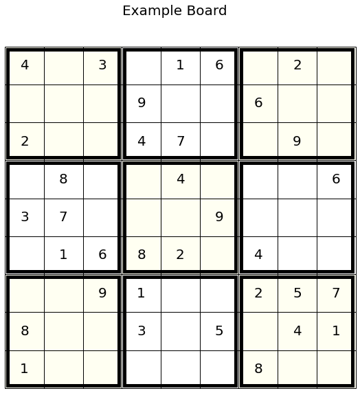
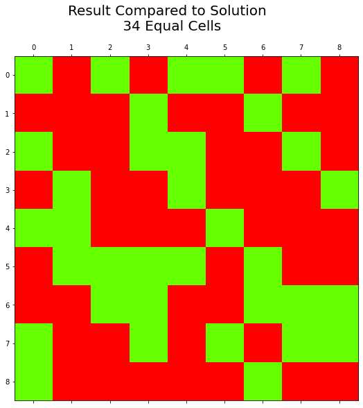
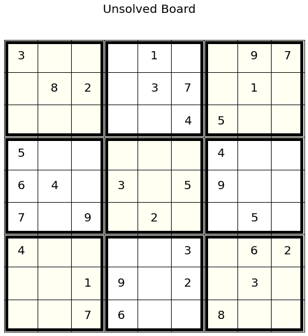
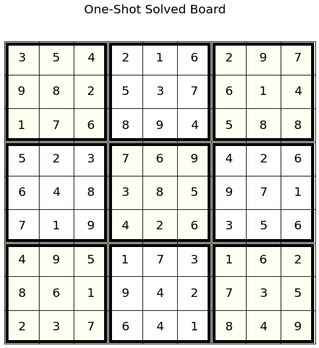
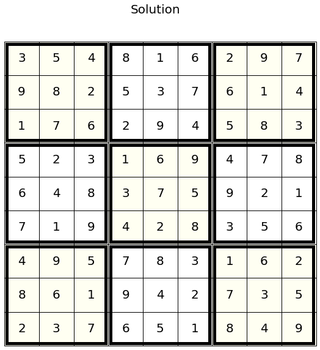
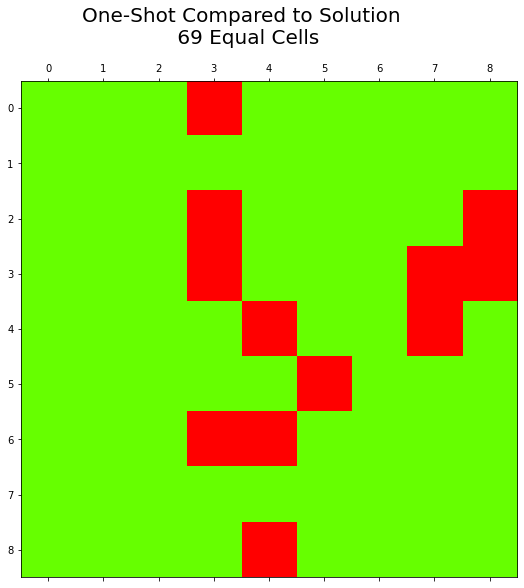
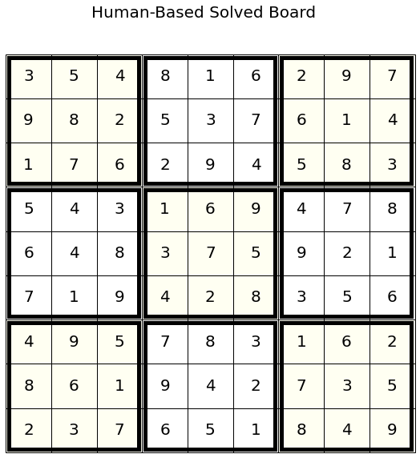
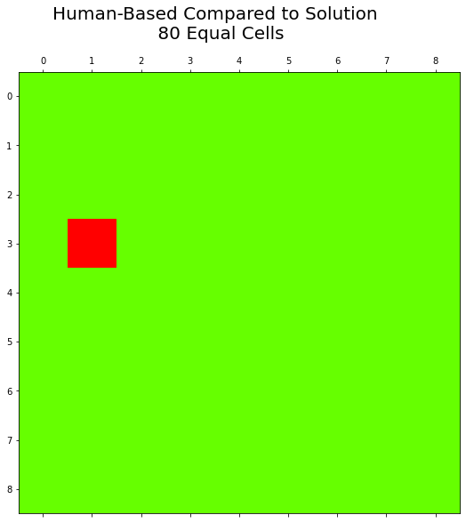

# Sudoku Solver: A Convolutional Neural Network Approach to 81 Squares
### By Jake Baldwin

## Dataset and Preprocessing

  First, import the libraries we ended up needing during this process.


```python
import numpy as np
import matplotlib.pyplot as plt
from PIL import Image
from scipy import ndimage
from tqdm import tqdm
import time
import pandas as pd
from torchvision import transforms
from matplotlib.colors import ListedColormap


import torch
import torch.nn as nn
import torch.nn.functional as F
from torch.utils.data import Dataset, DataLoader
```

Next, download the sudoku dataset that is being hosted on my github <br>
(I had to split the datset prior to uploading it to github because the size was too big, meaning it is already in a train, val and test set)


```python
!wget https://github.com/jbald17/sudoku/archive/refs/heads/main.zip
!unzip main.zip
```

    --2021-05-26 02:18:29--  https://github.com/jbald17/sudoku/archive/refs/heads/main.zip
    Resolving github.com (github.com)... 140.82.112.4
    Connecting to github.com (github.com)|140.82.112.4|:443... connected.
    HTTP request sent, awaiting response... 302 Found
    Location: https://codeload.github.com/jbald17/sudoku/zip/refs/heads/main [following]
    --2021-05-26 02:18:30--  https://codeload.github.com/jbald17/sudoku/zip/refs/heads/main
    Resolving codeload.github.com (codeload.github.com)... 140.82.112.10
    Connecting to codeload.github.com (codeload.github.com)|140.82.112.10|:443... connected.
    HTTP request sent, awaiting response... 200 OK
    Length: unspecified [application/zip]
    Saving to: ‘main.zip’
    
    main.zip                [      <=>           ]  16.50M  5.05MB/s    in 3.3s    
    
    2021-05-26 02:18:34 (5.05 MB/s) - ‘main.zip’ saved [17301292]
    
    Archive:  main.zip
    968d9fb6dcc94577ac8734b176e7f43368c92679
       creating: sudoku-main/
      inflating: sudoku-main/test_set.csv  
      inflating: sudoku-main/train_set.csv  
      inflating: sudoku-main/val_set.csv  


Next, using pandas to read in the data and take a look at it,


```python
f = pd.read_csv('sudoku-main/train_set.csv')
f.head()
```


<div>

<table border="1" class="dataframe">
  <thead>
    <tr style="text-align: right;">
      <th></th>
      <th>Unnamed: 0</th>
      <th>quizzes</th>
      <th>solutions</th>
    </tr>
  </thead>
  <tbody>
    <tr>
      <th>0</th>
      <td>0</td>
      <td>0043002090050090010700600430060020871900074000...</td>
      <td>8643712593258497619712658434361925871986574322...</td>
    </tr>
    <tr>
      <th>1</th>
      <td>1</td>
      <td>0401000501070039605200080000000000170009068008...</td>
      <td>3461792581875239645296483719658324174729168358...</td>
    </tr>
    <tr>
      <th>2</th>
      <td>2</td>
      <td>6001203840084590720000060050002640300700800069...</td>
      <td>6951273841384596727248369158512647392739815469...</td>
    </tr>
    <tr>
      <th>3</th>
      <td>3</td>
      <td>4972000001004000050000160986203000403009000000...</td>
      <td>4972583161864397252537164986293815473759641828...</td>
    </tr>
    <tr>
      <th>4</th>
      <td>4</td>
      <td>0059103080094030600275001000300002010008200070...</td>
      <td>4659123781894735623275681497386452919548216372...</td>
    </tr>
  </tbody>
</table>
</div>


Next, making use of PyTorches Dataset module, we create a custom sudoku dataset for parsing the strings in the data, and preparing it to be used in supervised learning. 
<br><br>
Note, as we can see above, the sudoku boards are loaded in as long strings '00430020...' where they are 81 digits long, 0's representing empty cells. Ideally, as CNN's preserve spatial dimensions, we would get this into a 9x9 matrix to be trained.


```python
class SudokuDataset(Dataset):

    def __init__(self, csv_file, transform=None, mode='train'):
      if mode == 'train':
        count = 70000
      else:
        count = 20000
      self.sudoku_frame = pd.read_csv(csv_file)[0:count]
      self.transform = transform 
      self.mode = mode

    def __len__(self):
      return len(self.sudoku_frame)

    def __getitem__(self, idx):
      quiz = self.sudoku_frame.loc[idx]['quizzes']
      solution = self.sudoku_frame.loc[idx]['solutions']
      pair = {'quiz': quiz, 'solution': solution}

      if self.transform:
        pair = self.transform(pair)

      return pair
```

As we can see, this dataset is pretty standard, where the real preprocessing and is seen in the transform method that is passed into the Dataset, here we try to accomplish a few things:
<ol> <li> We need to split the dataset into a 9x9 float tensor </li>
     <li> We need to normalize the data for better training </li>
     <li> We need to one-hot encode the tensor so we can use Softmax loss, and predict which class it will be </li>
</ol>


```python
def transform(pair):
  new_pair = {}
  for key in pair:
    if key == 'quiz':
      char_arr = list(pair[key])
      for i, c in enumerate(char_arr):
        char_arr[i] = int(c)

      arr = torch.IntTensor(char_arr)
      arr = arr.reshape(9, 9)
      arr = arr.to(torch.int64)
      arr = F.one_hot(arr, num_classes=10)
      arr = arr.to(torch.float)
      new_pair[key] = arr
    else:
      char_arr = list(pair[key])
      for i, c in enumerate(char_arr):
        char_arr[i] = int(c)

      arr = torch.IntTensor(char_arr)
      arr = arr.reshape(9, 9)
      arr = arr.to(torch.int64)
      new_pair[key] = arr
    

  return new_pair


# Thus, creating our datasets and dataloaders from the datasets, we set the
# batch_size to 25, and create our loaders.
train_dataset = SudokuDataset('sudoku-main/train_set.csv', transform=transform, mode='train')
train_dataloader = torch.utils.data.DataLoader(train_dataset, batch_size=25, shuffle=True)
val_dataset = SudokuDataset('sudoku-main/val_set.csv', transform=transform, mode='val')
val_dataloader = torch.utils.data.DataLoader(val_dataset, batch_size = 25, shuffle=True)
test_dataset = SudokuDataset('sudoku-main/test_set.csv', transform=transform, mode='test')
test_dataloader = torch.utils.data.DataLoader(test_dataset, batch_size=25, shuffle=False)
```

## Defining our Model
Now, we define our model. The architecture of a CNN is complex, ** TALK ABOUT WHAT BATCHNORM DOES, WHY THIS IS COMPLEX ENOUGH **


```python
class Model(nn.Module):

  def __init__(self):
    super().__init__()
    self.conv1 = nn.Conv2d(10, 32, 3, padding=1)
    self.conv2 = nn.Conv2d(32, 64, 3, padding=1)
    self.conv3 = nn.Conv2d(64, 128, 3, padding=1)
    self.conv4 = nn.Conv2d(128, 128, 3, padding=1)
    self.conv5 = nn.Conv2d(128, 128, 3, padding=1)
    self.conv6 = nn.Conv2d(128, 128, 3, padding=1)
    self.conv7 = nn.Conv2d(128, 128, 3, padding=1)
    self.conv8 = nn.Conv2d(128, 256, 3, padding=1)
    self.conv9 = nn.Conv2d(256, 10, 1)

    self.batchnorm1 = nn.BatchNorm2d(32)
    self.batchnorm2 = nn.BatchNorm2d(64)
    self.batchnorm0 = nn.BatchNorm2d(64)
    self.batchnorm3 = nn.BatchNorm2d(128)
    self.batchnorm4 = nn.BatchNorm2d(128)
    self.batchnorm5 = nn.BatchNorm2d(128)
    self.batchnorm6 = nn.BatchNorm2d(128)
    self.batchnorm7 = nn.BatchNorm2d(128)
    self.batchnorm8 = nn.BatchNorm2d(256)


  def forward(self, input):
    x = self.conv1(input)
    x = torch.relu(x)
    x = self.batchnorm1(x)
    x = self.conv2(x)
    x = torch.relu(x)
    x = self.batchnorm2(x)

    x = self.conv3(x)
    x = torch.relu(x)
    x = self.batchnorm3(x)
    x = self.conv4(x)
    x = torch.relu(x)
    x = self.batchnorm4(x)
    x = self.conv5(x)
    x = torch.relu(x)
    x = self.batchnorm5(x)

    x = self.conv6(x)
    x = torch.relu(x)
    x = self.batchnorm6(x)
    x = self.conv7(x)
    x = torch.relu(x)
    x = self.batchnorm7(x)
    
    x = self.conv8(x)
    x = torch.relu(x)
    x = self.batchnorm8(x)
    x = self.conv9(x)

    return x

```

## Training the Model
Now, we train the model, first setting our hyperparameters, then creating our optimizer, model, loss function and some other bells and whistles. A pretty standard training loop that converts the output to its predictions and compares its accuracy.


```python
# hyperparameters
epochs = 3
learning_rate = 0.001

# Creating model optimizer loss function
model = Model()
optimizer = torch.optim.Adam(model.parameters(), lr=learning_rate)
scheduler = torch.optim.lr_scheduler.StepLR(optimizer, step_size=2, gamma=0.9)
loss_function = nn.CrossEntropyLoss()

for epoch in range(epochs):
  model.train()
  train_loss = []
  val_loss = []
  train_acc = 0.
  val_acc = 0.
  count = 0
  
  for idx, batch in enumerate(train_dataloader):

    optimizer.zero_grad()
    quizzes, solutions = batch['quiz'], batch['solution']
    quizzes = quizzes.permute(0, 3, 1, 2)
    out = model(quizzes)
    loss = 0.
    loss = loss_function(out, solutions)

    train_loss.append(loss.item())
    train_acc = train_acc + torch.sum(out.argmax(1) == solutions)
    count = count + (len(batch['quiz']) * 81)
    loss.backward()
    optimizer.step()
    
  scheduler.step()

  train_acc = train_acc / count

  count = 0
  for idx, batch in enumerate(val_dataloader):
    model.eval()
    quizzes, solutions = batch['quiz'], batch['solution']
    quizzes = quizzes.permute(0, 3, 1, 2)
    out = model(quizzes)
    loss = loss_function(out, solutions)

    val_acc = val_acc + torch.sum(out.argmax(1) == solutions)
    count = count + (len(batch['quiz']) * 81)
    val_loss.append(loss.item())
  val_acc = val_acc / count
  if epoch % 1 == 0:
    print('Epoch: {}, Train Loss: {}, Train Acc {}, Val Loss: {}, Val acc: {}'.format(epoch, np.mean(train_loss), train_acc, np.mean(val_loss), val_acc))
```

    Epoch: 0, Train Loss: 0.6308419411416565, Train Acc 0.7371888756752014, Val Loss: 0.4129989586398006, Val acc: 0.8203345537185669
    Epoch: 1, Train Loss: 0.36698709139866487, Train Acc 0.8413206338882446, Val Loss: 0.33987365774810313, Val acc: 0.8528611063957214
    Epoch: 2, Train Loss: 0.3140191670826503, Train Acc 0.8647497296333313, Val Loss: 0.3087639195844531, Val acc: 0.8661993741989136


## Visualizing the boards

Representing a sudoku board as a 2D matrix is effective, but not the easiest thing to look at, so lets create some methods that take a 9x9 tensor and draws a pretty sudoku board to look at, and lets make another one that compares two sudoku boards and makes their similarity very visually intuitive.


```python
# Plot a 9x9 tensor to visualize the sudoku board
# Input: 9x9 tensor
# Out: None, plots 
def plot_board(grid, title):

  width = 9
  height = 9
  cell_size = 0.35

  arg = []

  for r in grid:
    t = []
    for c in r:
      if c == 0:
        t.append(None)
      else:
        t.append(c.item())
    arg.append(t)

  fig, ((ax1, ax2, ax3), (ax4, ax5, ax6), (ax7, ax8, ax9)) = plt.subplots(3, 3, figsize=(9, 9))
  fig.suptitle(title, fontsize=20)
  fig.subplots_adjust(wspace=0.05, hspace=0.05)

  plots = []
  for r in range(0, 9, 3):
    for c in range(0, 9, 3):
      plots.append([arg[r][c:c+3], arg[r+1][c:c+3], arg[r+2][c:c+3]])

  for id, (plot, data) in enumerate(zip([ax1, ax2, ax3, ax4, ax5, ax6, ax7, ax8, ax9], plots)):
    plot.axis('off')
    table = plot.table(cellText=data, loc='center')
    table.set_fontsize(20)
    for id2, (pos, cell) in enumerate(table._cells.items()):
      cell._height = cell._width = cell_size
      cell._loc = 'center'
      if id != 1 and id != 3 and id != 5 and id != 7:
        cell.set_facecolor('#fffff2')

    autoAxis = plot.axis()
    rec = plt.Rectangle((autoAxis[0], autoAxis[2]),(autoAxis[1]-autoAxis[0]),
                        (autoAxis[3]-autoAxis[2]),fill=False,lw=5)
    rec = plot.add_patch(rec)
    rec.set_clip_on(False)


# Compare two grids, output a graph showing equal inputs 
# in green, and unequal inputs in red
def compare_two(grid, solution, t1, t2):
  graph = []

  cmap = ListedColormap(['#ff0000', '#66ff00'])

  numEqual = 0
  for r in range(9):
    t = []
    for c in range(9):
      t.append(grid[r][c].item() == solution[r][c].item())
      if grid[r][c].item() == solution[r][c].item():
        numEqual = numEqual + 1
    graph.append(t)
  
  plt.matshow(graph, cmap=cmap)
  fig = plt.gcf()
  fig.suptitle('{} Compared to {} \n {} Equal Cells'.format(t1, t2, numEqual), fontsize=20)
  fig.set_size_inches(8.9, 8.9)
  fig

i, b = next(enumerate(val_dataloader))

grid = b['quiz'][0].argmax(2)
solution = b['solution'][0]

plot_board(grid, 'Example Board')
compare_two(grid, solution, 'Result', 'Solution')
```


    

    


    

    


## Using the Model


```python
i, b = next(enumerate(val_dataloader))
model.eval()

grid = b['quiz'].permute(0, 3, 1, 2)

quiz = grid[0].argmax(0)
solution = b['solution'][0]
out = model(grid)[0]

plot_board(quiz, 'Unsolved Board')
plot_board(out.argmax(0), 'One-Shot Solved Board')
plot_board(solution, 'Solution')
compare_two(out.argmax(0), solution, 'One-Shot', 'Solution')
```


    

    


    

    


    

    


    

    


## Human-Based Solving

Now, with our model we can try and implement a method for solving it as a human would. Meaning, a human solves sudoku one cell at a time, whereas a CNN, solves the entire board in one go, which is impressive but could lead to more mistakes. So, if we pass the board through the model one time, and select the cell that we have the highest confidence in, and then repeat until the board has been filled, we hopefully will have a higher accuracy process for solving sudoku.
<br><br>

Note, I noticed that the boards would get very close to 100% correct, usually just messing up the last cell, so by adding some training data that has 50%, even 90% fully solved sudoku boards could likely substantially increase the accuracy.
<br><br>

That being said, lets use these plotting methods from above, and human solve a board, to see if it yields good results.


```python
# input: 10x9x9 a quiz that has been forward passed through the network
# output: a 9x9 sudoku board that has only selected one more cell
def solve_cell(original, model_out):
  max_rowind = -1
  max_cellind = -1
  highest = 0.
  softmax = nn.Softmax(0)

  for row_ind, row in enumerate(model_out):
    for cell_ind, cell in enumerate(row):
      temp = max(softmax(cell))
      if temp > highest and original[row_ind][cell_ind] == 0:
        highest = temp
        max_rowind = row_ind
        max_cellind = cell_ind

  if max_rowind == -1:
    return True, original
  
  original[max_rowind][max_cellind] = model_out[max_rowind][max_cellind].argmax(0)

  return False, original

def human_solve(grid, model):
  model.eval()

  finished, grid = solve_cell(grid[0].argmax(2), model(b['quiz'].permute(0, 3, 1, 2))[0])
  i = 0
  while not finished:
    model_out = model(F.one_hot(grid, num_classes=10).reshape(1, 9, 9, 10).permute(0, 3, 1, 2).to(torch.float))
    finished, grid = solve_cell(grid, model_out[0].permute(1, 2, 0))
    i = i + 1

  return grid

#i, b = next(enumerate(val_dataloader))
solution = b['solution'][0]

grid = human_solve(b['quiz'], model)
plot_board(b['quiz'][0].argmax(2), 'Unsolved Board')
plot_board(grid, 'Human-Based Solved Board')
plot_board(solution, 'Solution')
compare_two(grid, solution, 'Human-Based', 'Solution')
```


    

    


    

    


    

    


    

    


```python

```
